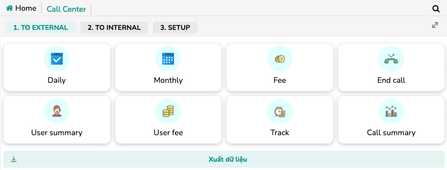

+++
author = "RealTimeX"
title = "Call Center"
date = "2019-03-10"
description = "Make calls from anywhere, record conversations for quality assurance, monitor agent performance in real-time, and analyze data for optimizing customer interactions."
price = "$5.5 /user /month"
tags = [
    "crm",
    "cxm",
    "app",
]
categories = [
    "CRM",
    "CXM"
]
image = "call-center.jpg"
feature = true
showFooter = true
+++

## Enhance Your Call Center Operations with rtWork Call Center

Efficient communication with customers is essential for businesses, and a well-managed call center plays a vital role in achieving this. With rtWork Call Center, you can optimize your call center operations by leveraging a cloud-based solution that provides flexible and remote calling, call recording, monitoring, and analytics.

## What is rtWork Call Center?

rtWork Call Center is a module within the comprehensive rtWork digital solution that solves the pain point of flexible and remote calling, call recording, monitoring, and analytics. This cloud-based solution allows users to make calls from anywhere, record conversations for quality assurance, monitor agent performance in real-time, and analyze data for optimizing customer interactions.

## Flexible and Remote Calling



With rtWork Call Center, your agents can make and receive calls from anywhere, providing the flexibility needed in today's remote work environment. Whether your team is working from home or on the go, they can stay connected with customers and provide exceptional service without limitations.

## Call Recording for Quality Assurance

The module offers call recording functionality, allowing you to capture conversations for quality assurance and compliance purposes. By recording calls, you can review interactions, identify areas for improvement, and ensure compliance with industry regulations. This feature helps maintain high service standards and enables effective training and coaching of call center agents.

## Real-time Monitoring of Agent Performance

rtWork Call Center enables real-time monitoring of agent performance. Supervisors can listen in on calls, provide instant feedback, and offer guidance to agents as needed. This monitoring capability ensures consistent service delivery and facilitates ongoing performance improvement. With real-time insights, you can address any issues promptly and optimize the customer experience.

## Analytics for Optimizing Customer Interactions

The module provides analytics tools that allow you to analyze call center data and gain valuable insights. By leveraging these insights, you can identify trends, measure key performance indicators (KPIs), and make data-driven decisions to optimize customer interactions. This data-driven approach helps you improve efficiency, enhance customer satisfaction, and drive better business outcomes.

## Pricing

- USD: $5.5/user/month