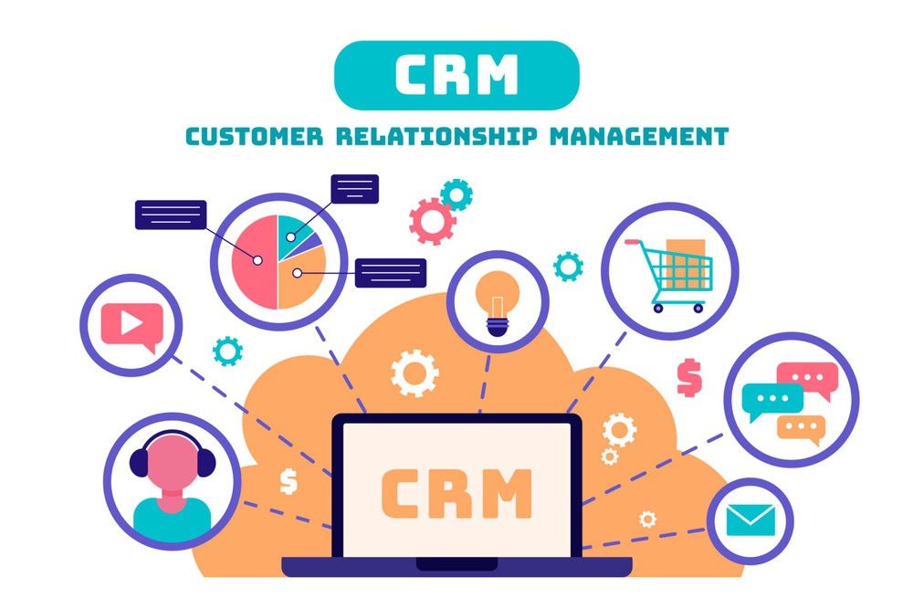

+++
author = "RealTimeX"
title = "CRM Dynamics"
date = "2019-03-10"
description = "Tập trung dữ liệu khách hàng, theo dõi tương tác và cung cấp thông tin giúp tăng cường sự tương tác và chiến lược bán hàng hiệu quả hơn."
price = "36.000₫ /tài khoản /tháng"
tags = [
    "crm",
    "app",
]
categories = [
    "Khách hàng",
    "Bán hàng",
]
image = "rtwork-crm.jpg"
+++

# 

<!--  -->

Trong cảnh cạnh tranh kinh doanh ngày nay, duy trì mối quan hệ khách hàng mạnh mẽ là rất quan trọng để đạt được thành công. Với nhu cầu ngày càng tăng của khách hàng, các doanh nghiệp cần một công cụ mạnh mẽ để quản lý tương tác và tăng cường sự tương tác tốt hơn. Đó là lúc rtWork CRM Dynamics xuất hiện.

## rtWork CRM Dynamics là gì?

rtWork CRM Dynamics là một module trong giải pháp kỹ thuật số toàn diện rtWork, giúp các doanh nghiệp quản lý mối quan hệ khách hàng của họ một cách hiệu quả hơn. Bằng cách tập trung dữ liệu khách hàng, theo dõi tương tác và cung cấp thông tin quan trọng, module này giúp các doanh nghiệp phát triển chiến lược tương tác và bán hàng tốt hơn.

## Có cái nhìn 360 độ về khách hàng của bạn

rtWork CRM Dynamics cho phép bạn thu thập và tổ chức dữ liệu khách hàng quan trọng trong một vị trí tập trung. Với cái nhìn 360 độ về khách hàng của bạn, bạn có thể dễ dàng truy cập thông tin như chi tiết liên hệ, lịch sử mua hàng, vé hỗ trợ và nhật ký giao tiếp. Tổng quan toàn diện này giúp bạn hiểu khách hàng của mình tốt hơn và tùy chỉnh tương tác theo nhu cầu cụ thể của họ.

## Theo dõi tương tác và cải thiện sự tương tác

Module này cho phép bạn theo dõi tương tác của khách hàng trên nhiều kênh khác nhau, bao gồm email, cuộc gọi điện thoại, mạng xã hội và cuộc họp trực tiếp. Bằng cách ghi lại những tương tác này, bạn có thể đảm bảo không có cuộc trò chuyện hay cơ hội quý giá nào bị bỏ lỡ. Phương pháp toàn diện này giúp bạn cung cấp phản hồi cá nhân hóa và kịp thời, dẫn đến sự hài lòng và tương tác tốt hơn từ khách hàng.

## Thúc đẩy chiến lược bán hàng hiệu quả

rtWork CRM Dynamics trang bị đội ngũ bán hàng của bạn với các công cụ cần thiết để thành công. Module này cho phép bạn quản lý cơ hội, theo dõi giao dịch và giám sát quy trình bán hàng. Với dữ liệu và thông tin thời gian thực, bạn có thể xác định các chướng ngại tiềm năng, ưu tiên cơ hội và đưa ra quyết định thông minh để tối đa hóa cơ hội bán hàng. Phương pháp dựa trên dữ liệu này giúp đội ngũ bán hàng của bạn đóng gói giao dịch một cách hiệu quả hơn và thúc đẩy doanh thu tăng trưởng.

## Tận dụng thông tin để đưa ra quyết định tốt hơn

Ngoài việc tập trung dữ liệu khách hàng và theo dõi tương tác, rtWork CRM Dynamics cung cấp thông tin quý giá có thể hỗ trợ các chiến lược kinh doanh của bạn. Bằng cách tận dụng trí tuệ nhân tạo và phân tích dự đoán, module này giúp bạn nhận biết xu hướng, dự đoán nhu cầu của khách hàng và đưa ra quyết định dựa trên dữ liệu. Những thông tin này giúp bạn tối ưu hóa chiến dịch marketing, hoàn thiện sản phẩm và mang đến trải nghiệm cá nhân hóa phù hợp với khách hàng của bạn.

## Tích hợp và tùy chỉnh mượt mà

rtWork CRM Dynamics tích hợp mượt mà với các module rtWork khác, cho phép bạn tạo một không gian làm việc tùy chỉnh phù hợp với nhu cầu kinh doanh cụ thể của bạn. Cho dù bạn cần kết hợp CRM với quản lý nhân sự, quản lý nhiệm vụ, tài chính hoặc bất kỳ module nào khác, rtWork cung cấp một giải pháp linh hoạt và có khả năng mở rộng. Việc tích hợp này loại bỏ các ngăn cách và cho phép sự cộng tác hiệu quả giữa các bộ phận khác nhau, cuối cùng dẫn đến nâng cao năng suất và tối ưu hóa hoạt động.

## Giá

- 36.000đ/tài khoản /tháng
