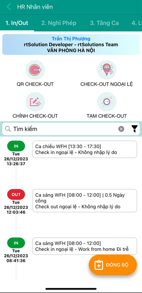

+++
author = "RealTimeX"
title = "HR Management"
date = "2023-12-26"
description = "HR all-in-one, all employee's human resources activities in real-time."
price = "$1.5 /user /month"
tags = [
    "hrm",
    "rtWork",
    "RTA"
]
categories = [
    "HRM",
    "RTA"
]
image = "hr-management.png"
feature = true
showFooter = true
+++

## Introduction

Human Resource Management (HRM) is a crucial function in every organization. It involves managing the people within an organization to achieve the company's goals and objectives effectively. HR management encompasses various activities, including recruitment, selection, training, performance evaluation, compensation, and employee relations.

Effective HR management is vital for the success of any organization.

HR management is essential for organizations to thrive in today's competitive business landscape. With its wide range of responsibilities, HR management plays a critical role in attracting, developing, and retaining talent, enhancing employee engagement, and maintaining a positive work culture. By successfully managing human resources, organizations can achieve their strategic goals and drive long-term success.

## HR For Supervisor

- Approve employee requests
- Managers approve employees' business trips, leave requests, and overtime work schedules.

## HR For Employees

- Self-operate daily human resources operations
- All employees perform timekeeping based on actual working hours, view work schedules, check annual leave quotas, and request leave, overtime, or additional hours.

## HR For Manager

- Establish personnel operating regulations
Set up flexible human resource policies applicable to the business (annual leave days, sick leave, overtime wage policies, work shifts, - regulations).

## Pricing

- USD: $1.5/user/month