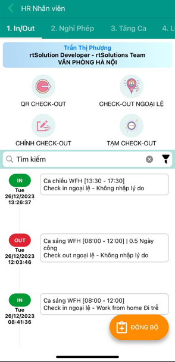

+++
author = "RealTimeX"
title = "Quản lý nhân sự"
date = "2023-12-26"
description = "HR all-in-one, cập nhật theo thời gian thực mọi hoạt động nhân sự của tất cả nhân viên: Check-In/Out, Nghỉ phép, Tăng ca, ..."
price = "36.000₫ /tài khoản /tháng"
tags = [
    "hrm",
    "rtWork",
    "RTA"
]
categories = [
    "HRM",
    "RTA"
]
image = "hr-management.png"
feature = true
showFooter = true
+++

## Giới thiệu

Quản lý Nhân sự (HRM) luôn là một vấn đề quan trọng được ưu tiên hàng đầu ở mọi tổ chức/doanh nghiệp. Quản lý Nhân sự là quản lý con người trong tổ chức, bao gồm nhiều hoạt động khác nhau: Tuyển dụng, Đào tạo, Đánh giá, Hoạt động của nhân sự như Check-In/Out, Nghỉ phép, Tăng ca, Lịch làm việc, ... Mọi tổ chức/Doanh nghiệp đều có nhu cầu quản lý một cách hiệu quả nhân sự của mình. 

Quản lý nhân sự hiệu quả là yếu tố quan trọng để tổ chức phát triển trong bối cảnh nền kinh tế cạnh tranh ngày nay. Với nhiều trách nhiệm đa dạng, quản lý nhân sự đóng vai trò quan trọng trong việc thu hút, phát triển và giữ chân nhân tài, nâng cao sự tham gia của nhân viên và duy trì một văn hóa làm việc tích cực. Bằng cách quản lý nhân sự một cách thành công, tổ chức có thể đạt được mục tiêu chiến lược và thúc đẩy sự thành công lâu dài.

## HR cho Giám sát / SUP

- Phê duyệt các yêu cầu của nhân viên & SUP luôn được cập nhật thông tin của nhân sự tại mọi thời điểm
- Các quản lý phê duyệt Check-In/Out, lịch trình công tác, yêu cầu nghỉ phép và lịch làm việc ngoài giờ của nhân viên.

## HR cho Nhân viên

- Nhân viên tự thực hiện và theo dõi các hoạt động nhân sự hàng ngày của mình trên các thiết bị di động nền tảng iOS, Android, Web, ...
Tất cả nhân viên thực hiện chấm công dựa trên giờ làm việc thực tế, xem lịch làm việc, kiểm tra số ngày nghỉ phép hàng năm và yêu cầu nghỉ phép, làm thêm giờ hoặc làm thêm giờ.

## HR cho Quản lý

- Thiết lập quy định vận hành nhân sự
Thiết lập các chính sách nhân sự linh hoạt áp dụng cho doanh nghiệp (số ngày nghỉ phép hàng năm, nghỉ ốm, chính sách làm thêm giờ, ca làm việc, quy định).

## Giá

- 36.000đ/tài khoản /tháng