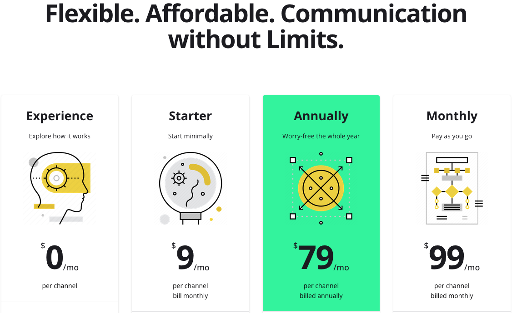

+++
author = "RealTimeX"
title = "AI Transformation for SMEs: Unlocking Competitive Advantage in the Digital Era"
date = "2023-10-28T10:00:00Z"
description = "Artificial Intelligence (AI) represents a unique opportunity to adapt, become agile, and stay competitive. AI offers SMEs the means to compete with larger enterprises and unlock new levels of efficiency and growth."
tags = [
    "ai",
    "transformation",
]
image = "automate_aichat_allinone.gif"
+++

In today's rapidly evolving business landscape, digital transformation has emerged as a crucial imperative for organizations across industries. However, the path to successful digital transformation is fraught with challenges, with numerous studies reporting high failure rates. For small and medium-sized enterprises (SMEs) that have yet to fully embrace digitalization, the integration of Artificial Intelligence (AI) represents a unique opportunity to adapt, become agile, and stay competitive. Unlike traditional digital transformation initiatives, AI transformation offers SMEs a powerful and affordable solution that can drive tangible benefits with minimal resistance.

## The Power of AI for SMEs

AI is a game-changer for SMEs, offering capabilities that were once exclusive to large corporations. Leveraging AI technologies such as machine learning and natural language processing, SMEs can automate and optimize various business processes, enhance decision-making, and gain valuable insights from vast amounts of data. AI-powered solutions can significantly improve operational efficiency, customer experience, and overall business performance.

## Affordable and Accessible

One of the key advantages of AI transformation for SMEs is its affordability. Unlike traditional digital transformation projects that often require substantial investments in infrastructure and expertise, AI solutions are increasingly accessible and cost-effective. Cloud-based AI platforms and services allow SMEs to leverage pre-built models and tools, eliminating the need for extensive in-house AI expertise. This democratization of AI technology enables SMEs to compete on a level playing field with larger enterprises, fostering innovation and growth.
  

## Rapid Deployment and Immediate Benefits

AI transformation offers SMEs the advantage of fast application deployment. With user-friendly AI platforms, SMEs can start leveraging AI capabilities within minutes, without the need for complex implementation processes. This agility allows SMEs to quickly adapt to market demands, identify new opportunities, and deliver personalized experiences to their customers. Furthermore, the immediate benefits of AI are evident to all stakeholders, from business owners to employees. AI-driven automation can streamline repetitive tasks, freeing up employees to focus on higher-value activities, leading to increased job satisfaction and productivity.

## Creating Traction for Digital Transformation

AI transformation serves as a catalyst for broader digital transformation efforts within SMEs. By successfully implementing AI solutions, SMEs build confidence and experience in leveraging digital technologies. This positive momentum can then be leveraged to drive further digital initiatives, such as adopting cloud computing, implementing data analytics, or embracing e-commerce. AI acts as a stepping stone, propelling SMEs towards a comprehensive and sustainable digital transformation journey.

Artificial Intelligence transformation presents a golden opportunity for SMEs to adapt, innovate, and thrive in the digital age. With its powerful capabilities, affordability, rapid deployment, and immediate benefits, AI offers SMEs the means to compete with larger enterprises and unlock new levels of efficiency and growth. By embracing AI transformation, SMEs can pave the way for broader digital transformation initiatives, positioning themselves as agile, customer-centric organizations ready to navigate the challenges and seize the opportunities of the future.