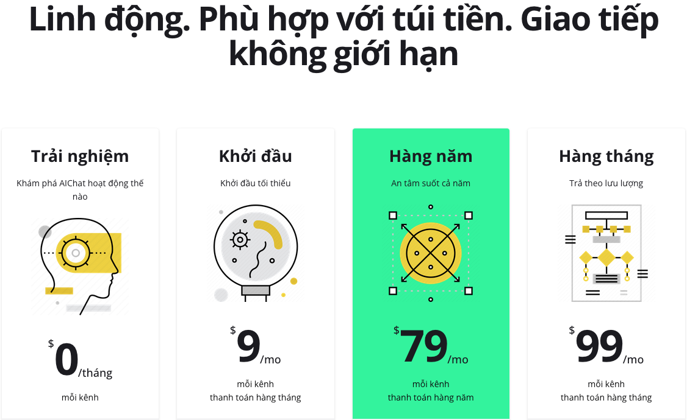

+++
author = "RealTimeX"
title = "Chuyển đổi trí tuệ nhân tạo cho doanh nghiệp vừa và nhỏ: Mở khóa lợi thế cạnh tranh trong kỷ nguyên số"
date = "2023-10-28T10:00:00Z"
description = "Trí tuệ nhân tạo (AI) đại diện cho một cơ hội độc đáo để thích nghi, trở nên linh hoạt và duy trì sự cạnh tranh. AI cung cấp cho các doanh nghiệp vừa và nhỏ (SMEs) cách để cạnh tranh với các doanh nghiệp lớn hơn và mở khóa những mức độ hiệu quả và tăng trưởng mới."
tags = [
    "ai",
    "transformation",
]
image = "automate_aichat_allinone.gif"
+++

Trong cảnh quan kinh doanh ngày nay đang phát triển nhanh chóng, sự chuyển đổi kỹ thuật số đã trở thành một nhiệm vụ cấp bách đối với các tổ chức trong mọi ngành công nghiệp. Tuy nhiên, con đường đến thành công trong việc chuyển đổi kỹ thuật số đầy thách thức, với nhiều nghiên cứu báo cáo tỷ lệ thất bại cao. Đối với các doanh nghiệp vừa và nhỏ (SMEs) chưa hoàn toàn áp dụng kỹ thuật số, việc tích hợp Trí tuệ nhân tạo (AI) đại diện cho một cơ hội độc đáo để thích nghi, trở nên linh hoạt và cạnh tranh. Khác với các dự án chuyển đổi kỹ thuật số truyền thống, việc chuyển đổi AI cung cấp cho SMEs một giải pháp mạnh mẽ và giá cả phải chăng có thể mang lại lợi ích rõ ràng với sự chống cự tối thiểu.

## Sức mạnh của AI đối với SMEs

AI là một yếu tố quyết định cho SMEs, mang đến những khả năng trước đây chỉ dành riêng cho các công ty lớn. Bằng cách tận dụng các công nghệ AI như học máy và xử lý ngôn ngữ tự nhiên, SMEs có thể tự động hóa và tối ưu hóa các quy trình kinh doanh khác nhau, nâng cao quyết định và thu được thông tin quý giá từ lượng dữ liệu lớn. Các giải pháp được cung cấp bởi AI có thể cải thiện đáng kể hiệu suất hoạt động, trải nghiệm khách hàng và hiệu suất kinh doanh tổng thể.

## Giá cả phải chăng và dễ tiếp cận

Một trong những lợi thế chính của việc chuyển đổi AI đối với SMEs là tính phải chăng của nó. Khác với các dự án chuyển đổi kỹ thuật số truyền thống thường đòi hỏi đầu tư đáng kể vào cơ sở hạ tầng và chuyên môn, các giải pháp AI ngày càng dễ tiếp cận và hiệu quả về giá cả. Các nền tảng và dịch vụ AI dựa trên đám mây cho phép SMEs tận dụng các mô hình và công cụ đã được xây dựng sẵn, loại bỏ nhu cầu về chuyên môn AI trong nhà. Sự dân chủ hóa công nghệ AI này cho phép SMEs cạnh tranh trên cùng một sân chơi với các doanh nghiệp lớn, thúc đẩy sự đổi mới và tăng trưởng.
  

  
## Triển khai nhanh chóng và lợi ích ngay lập tức

Chuyển đổi AI mang lại lợi thế triển khai ứng dụng nhanh chóng cho SMEs. Với các nền tảng AI dễ sử dụng, SMEs có thể bắt đầu tận dụng khả năng AI chỉ trong vài phút, mà không cần quá trình triển khai phức tạp. Sự linh hoạt này cho phép SMEs nhanh chóng thích ứng với yêu cầu thị trường, xác định cơ hội mới và mang đến trải nghiệm cá nhân hóa cho khách hàng của họ. Hơn nữa, lợi ích ngay lập tức của AI rõ ràng đối với tất cả các bên liên quan, từ chủ doanh nghiệp đến nhân viên. Tự động hóa dựa trên AI có thể tối ưu hóa các nhiệm vụ lặp đi lặp lại, giải phóng nhân viên để tập trung vào các hoạt động có giá trị cao hơn, dẫn đến sự hài lòng và năng suất công việc tăng lên.

## Tạo đà cho chuyển đổi kỹ thuật số

Chuyển đổi AI đóng vai trò như một chất xúc tác cho các nỗ lực chuyển đổi kỹ thuật số rộng hơn trong SMEs. Bằng cách triển khai thành công các giải pháp AI, SMEs xây dựng sự tự tin và kinh nghiệm trong việc tận dụng các công nghệ số. Đà tích cực này sau đó có thể được sử dụng để thúc đẩy các sáng kiến kỹ thuật số khác, chẳng hạn như áp dụng điện toán đám mây, triển khai phân tích dữ liệu hoặc om sát thương mại điện tử. AI đóng vai trò như một bước đệm, đẩy SMEs tiến tới một hành trình chuyển đổi kỹ thuật số toàn diện và bền vững.

Chuyển đổi Trí tuệ nhân tạo mang lại cơ hội vàng cho SMEs để thích nghi, đổi mới và phát triển trong thời đại kỹ thuật số. Với khả năng mạnh mẽ, giá cả phải chăng, triển khai nhanh chóng và lợi ích ngay lập tức, AI cung cấp cho SMEs các phương tiện để cạnh tranh với các doanh nghiệp lớn và mở khóa các mức độ hiệu quả và tăng trưởng mới. Bằng cách chấp nhận chuyển đổi AI, SMEs có thể mở đường cho các sáng kiến chuyển đổi kỹ thuật số rộng hơn, định vị chính mình như các tổ chức linh hoạt, tập trung vào khách hàng sẵn sàng đối mặt với thách thức và nắm bắt cơ hội của tương lai.